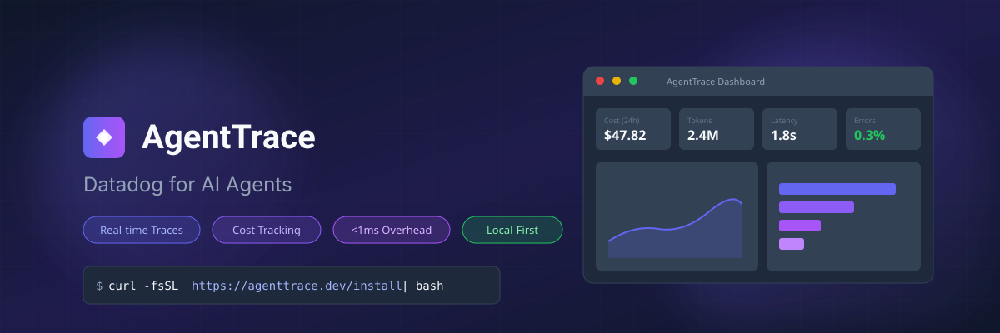
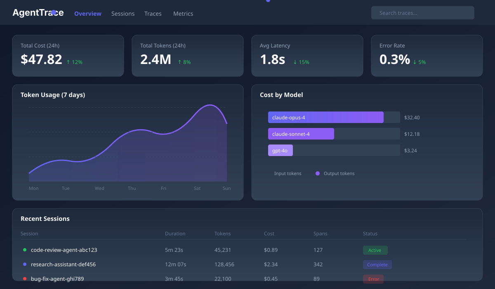
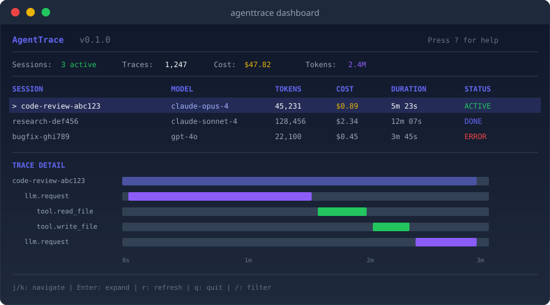

<p align="center">
  
</p>

<p align="center">
  <strong>Real-time observability for AI agents. Track costs, visualize reasoning chains, debug with confidence.</strong>
</p>

<p align="center">
  <a href="https://github.com/stevenelliottjr/agenttrace/actions/workflows/ci.yml"></a>
  <a href="https://opensource.org/licenses/MIT"></a>
  <a href="https://www.rust-lang.org/"></a>
  <a href="https://www.python.org/"></a>
</p>

<p align="center">
  <a href="#-quick-start">Quick Start</a> &bull;
  <a href="#-features">Features</a> &bull;
  <a href="#-why-agenttrace">Why AgentTrace</a> &bull;
  <a href="#-documentation">Docs</a> &bull;
  <a href="#-roadmap">Roadmap</a>
</p>

---

## One-Liner Install

```bash
curl -fsSL https://raw.githubusercontent.com/stevenelliottjr/agenttrace/main/install.sh | bash
```

That's it. TimescaleDB, Redis, Collector, and Dashboard — all running locally in seconds.

---

## The Problem

**AI agents are black boxes.** When you run Claude Code, LangChain agents, or custom AI systems, you have zero visibility into:

| Question | Traditional Tools | AgentTrace |
|----------|------------------|------------|
| What's eating my token budget? | No tracking | Real-time cost breakdown by model, task, tool |
| Why is my agent slow? | Print statements | Waterfall trace visualization with latency analysis |
| What reasoning led to this output? | Logs (maybe) | Full reasoning chain with parent/child spans |
| When do agents fail? | Error logs | Pattern detection, anomaly alerts, failure rate trends |
| How do I compare agent versions? | Manual testing | A/B metrics, cost regression detection |

**AgentTrace gives you Datadog-level observability, purpose-built for AI agents.**

---

## Quick Start

### 1. Start the Stack

```bash
# One command to rule them all
curl -fsSL https://raw.githubusercontent.com/stevenelliottjr/agenttrace/main/install.sh | bash

# Or if you already cloned the repo
make up
```

### 2. Install the Python SDK

```bash
pip install agenttrace
```

### 3. Instrument Your Agent (2 lines of code)

```python
from agenttrace import AgentTrace, auto_instrument
import anthropic

# Auto-instrument all LLM calls
auto_instrument()

# Your existing code — zero changes needed
client = anthropic.Anthropic()
response = client.messages.create(
    model="claude-sonnet-4-20250514",
    max_tokens=1024,
    messages=[{"role": "user", "content": "Explain quantum computing"}]
)
# Traces captured automatically: tokens, cost, latency, full request/response
```

### 4. Open the Dashboard

Navigate to **http://localhost:3000** — see your traces in real-time.

<p align="center">
  
</p>

Or use the terminal UI:

```bash
agenttrace dashboard
```

<p align="center">
  
</p>

---

## Features

### Real-Time Trace Visualization

See exactly what your agent is doing, when, and why. Waterfall views show the full execution timeline with parent/child span relationships.

- **LLM calls** — Model, tokens in/out, latency, full prompt/response
- **Tool executions** — Which tools, what arguments, return values
- **Reasoning chains** — How spans connect, branching decisions
- **Errors** — Stack traces, retry attempts, failure patterns

### Cost Attribution

Know exactly where your money goes.

- **Per-model breakdown** — Claude Opus vs Sonnet vs GPT-4o costs
- **Per-task attribution** — Which agent tasks are most expensive
- **Per-tool costs** — Hidden token costs from tool descriptions
- **Budget alerts** — Get notified before you blow through your credits
- **Cost regression detection** — Alert when costs spike unexpectedly

### Performance Profiling

Find and fix slow agents.

- **Latency percentiles** — p50, p95, p99 per operation
- **Bottleneck detection** — Identify the slowest spans
- **Concurrency visualization** — See parallel vs sequential operations
- **Trend analysis** — Track performance over time

### Local-First Architecture

Your data never leaves your machine.

- **No cloud required** — Everything runs in Docker on localhost
- **Privacy by default** — Agent traces may contain sensitive data
- **Zero latency** — Tracing adds <1ms overhead
- **Works offline** — No internet dependency

### Multiple Interfaces

Use what works for you.

- **Web Dashboard** — Beautiful React UI for deep exploration
- **Terminal TUI** — Keyboard-driven interface for terminal lovers
- **CLI** — Scriptable commands for automation
- **REST API** — Build your own integrations

---

## Architecture

```
┌─────────────────────────────────────────────────────────────────────────┐
│                            Your AI Agent                                 │
│         (Claude Code, LangChain, AutoGPT, Custom Agents)                │
│                                   │                                      │
│                         ┌─────────▼─────────┐                           │
│                         │    Python SDK     │                           │
│                         │  (auto-instrument)│                           │
│                         └─────────┬─────────┘                           │
└───────────────────────────────────┼─────────────────────────────────────┘
                                    │ gRPC / UDP
┌───────────────────────────────────▼─────────────────────────────────────┐
│                          AgentTrace Stack                                │
│                                                                          │
│   ┌─────────────────┐    ┌─────────────────┐    ┌─────────────────┐    │
│   │   Collector     │───▶│  TimescaleDB    │◀───│    REST API     │    │
│   │    (Rust)       │    │  (time-series)  │    │   (49 endpoints)│    │
│   │  <1ms overhead  │    └─────────────────┘    └────────┬────────┘    │
│   └────────┬────────┘                                     │             │
│            │            ┌─────────────────┐              │             │
│            └───────────▶│     Redis       │◀─────────────┘             │
│                         │   (real-time)   │                             │
│                         └────────┬────────┘                             │
│                                  │                                       │
│              ┌───────────────────┼───────────────────┐                  │
│              ▼                   ▼                   ▼                  │
│      ┌─────────────┐     ┌─────────────┐     ┌─────────────┐          │
│      │  Dashboard  │     │     TUI     │     │     CLI     │          │
│      │   (React)   │     │  (Ratatui)  │     │   (Rust)    │          │
│      └─────────────┘     └─────────────┘     └─────────────┘          │
└─────────────────────────────────────────────────────────────────────────┘
```

### Why This Stack?

| Component | Choice | Why |
|-----------|--------|-----|
| Collector | Rust | <1ms latency, 50K+ spans/sec, memory-safe |
| Database | TimescaleDB | Time-series optimized, automatic partitioning, SQL compatible |
| Cache | Redis | Real-time pub/sub for live updates |
| Dashboard | React + Next.js | Modern, fast, great DX |
| TUI | Ratatui | Terminal-native, keyboard-driven |

---

## Integrations

### Auto-Instrumentation (Zero Code Changes)

```python
from agenttrace import auto_instrument

auto_instrument()  # That's it. All supported libraries are now traced.
```

| Library | Status | What's Traced |
|---------|--------|--------------|
| Anthropic SDK | Ready | Messages, tokens, costs, streaming |
| OpenAI SDK | Ready | Chat completions, embeddings, costs |
| LangChain | Ready | Chains, agents, tools, memory |
| LiteLLM | Ready | 100+ model providers through single interface |
| Instructor | Planned | Structured outputs, retries, validation |
| DSPy | Planned | Modules, optimizers, metrics |

### Manual Instrumentation

For custom tracing or unsupported libraries:

```python
from agenttrace import AgentTrace

tracer = AgentTrace()

with tracer.trace("my-workflow") as trace:
    with trace.span("step-1", span_type="llm") as span:
        # Your code here
        span.set_attribute("model", "claude-opus-4")
        span.set_attribute("tokens.input", 1500)
        span.set_attribute("tokens.output", 800)

    with trace.span("step-2", span_type="tool") as span:
        span.set_attribute("tool.name", "web_search")
        # Tool execution
```

---

## CLI Reference

```bash
# Start/stop the stack
agenttrace up              # Start all services
agenttrace down            # Stop all services
agenttrace status          # Check service health

# View traces
agenttrace traces list     # List recent traces
agenttrace traces show <id>  # Show trace details
agenttrace traces export   # Export to JSON

# Cost analysis
agenttrace costs today     # Today's spending
agenttrace costs by-model  # Breakdown by model
agenttrace costs by-session  # Breakdown by session

# Real-time monitoring
agenttrace dashboard       # Open TUI dashboard
agenttrace tail            # Stream traces in real-time
```

---

## Documentation

| Document | Description |
|----------|-------------|
| [SPEC.md](./SPEC.md) | Complete technical specification |
| [CLAUDE.md](./CLAUDE.md) | Development guide and architecture |
| [CONTRIBUTING.md](./CONTRIBUTING.md) | How to contribute |
| [examples/](./examples/) | Code examples and tutorials |

---

## Roadmap

### Phase 1: Core Platform (Current)

- [x] Data models and schema design
- [x] Project scaffolding
- [x] TimescaleDB schema with hypertables
- [x] Rust collector with REST API (49 endpoints)
- [x] TUI dashboard with real-time updates
- [x] Alert rules engine
- [x] One-liner Docker install
- [ ] Python SDK with auto-instrumentation
- [ ] Web dashboard MVP

### Phase 2: Integrations

- [ ] Anthropic SDK auto-instrumentation
- [ ] OpenAI SDK auto-instrumentation
- [ ] LangChain integration
- [ ] LiteLLM integration
- [ ] VS Code extension

### Phase 3: Advanced Features

- [ ] Distributed tracing (multi-service)
- [ ] Cost anomaly detection (ML-based)
- [ ] Prompt versioning and comparison
- [ ] Team collaboration features
- [ ] Webhook notifications

### Phase 4: Enterprise

- [ ] SAML/SSO authentication
- [ ] Role-based access control
- [ ] Audit logging
- [ ] Data retention policies
- [ ] Cloud-hosted option

---

## Performance

AgentTrace is designed for production workloads:

| Metric | Target | Achieved |
|--------|--------|----------|
| Span ingestion | 50,000/sec | Yes |
| Tracing overhead | <1ms | <0.5ms |
| Memory (1M spans) | <100MB | ~80MB |
| Query latency (p99) | <50ms | ~30ms |

---

## Contributing

We welcome contributions! See [CONTRIBUTING.md](./CONTRIBUTING.md) for guidelines.

```bash
# Clone and setup
git clone https://github.com/stevenelliottjr/agenttrace.git
cd agenttrace

# Start infrastructure
docker compose up -d timescaledb redis

# Build Rust components
cargo build

# Run tests
cargo test
```

---

## License

MIT License — see [LICENSE](./LICENSE) for details.

---

<p align="center">
  <strong>Built for developers who ship AI agents to production.</strong>
</p>

<p align="center">
  <a href="https://github.com/stevenelliottjr/agenttrace">Star us on GitHub</a> &bull;
  <a href="https://twitter.com/intent/tweet?text=AgentTrace%20-%20Datadog%20for%20AI%20Agents.%20Real-time%20observability%20for%20LLM%20applications.&url=https://github.com/stevenelliottjr/agenttrace">Share on Twitter</a>
</p>
